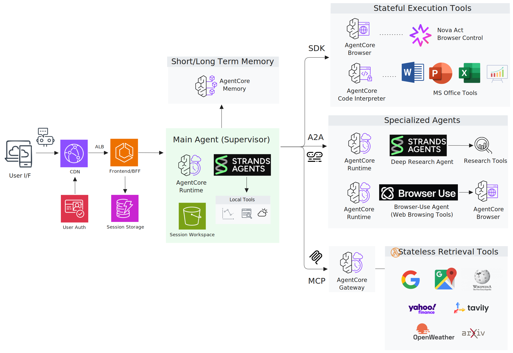

# Strands Agent Chatbot with Amazon Bedrock AgentCore

An end-to-end reference architecture for building **agentic workflows** using  
**Strands Agents** and **Amazon Bedrock AgentCore**.

This repository demonstrates how to design and deploy a multi-agent chatbot that combines
tool execution, memory, browser automation, and agent-to-agent collaboration.
It is intended as a realistic, extensible sample for teams exploring advanced agent architectures on AWS.

---

## What this repository demonstrates

- Multi-agent orchestration with **Strands Agents**
- Integration with **Amazon Bedrock AgentCore**
- Tool-enabled agents (search, finance, weather, browser, code interpreter)
- Autonomous browser, documentation, and analysis workflows
- Modular architecture adaptable to real customer use cases
- Infrastructure-as-Code (CDK) for repeatable deployment

If you are building **agentic AI applications on AWS** and want a concrete, end-to-end example,
this repository is designed to be read, run, and extended.

**Quick links:**  
[Architecture](#architecture-overview) · [Key Features](#key-features) · [Quick Start](#quick-start)

---

## Demo Scenarios

This sample includes multiple real-world agent workflows:

- Financial research and analysis
- Travel planning with external data sources
- Autonomous web browsing and information extraction
- Tool-augmented reasoning with structured outputs
- Multi-agent research with human approval loops

> **▶️ Click any thumbnail to watch the demo video**

<table>
<tr>
<td width="400">
<a href="https://drive.google.com/file/d/1swDfKm6U-SmXTPtn_Y_jZ1H-9UaU_cEU/view?usp=sharing">

</a>
</td>
<td>

### 0. UI Overview

Interactive demonstration of the chatbot interface, dynamic tool filtering,
multi-model selection, and real-time streaming responses.

**Highlights**
- Tool selection sidebar  
- Multi-model support (20+ models)  
- SSE streaming  
- Session management  
- Multimodal file upload  

</td>
</tr>

<tr>
<td width="400">
<a href="https://drive.google.com/file/d/1mN62tmRPSiYv1mlYnMrwjM2nQbA4ll1_/view?usp=sharing">

</a>
</td>
<td>

### 1. Finance Assistant

Analyzes FAANG stocks using real-time quotes and historical performance data,
performs statistical analysis, and generates Excel reports with visualizations.

**Highlights**
- Yahoo Finance via MCP Gateway  
- Secure code execution with AgentCore Code Interpreter  
- Chart generation and document creation  

</td>
</tr>

<tr>
<td width="400">
<a href="https://drive.google.com/file/d/1porEklKoxSZEZt1wNYvBjFiRUZ12fIwI/view?usp=sharing">

</a>
</td>
<td>

### 2. Travel Planning

Plans a Honolulu trip by gathering articles, location data, routes,
and weather information through interactive dialogue.

**Highlights**
- Google Search, Maps, and Places via MCP Gateway  
- Open-Meteo Weather API  
- Embedded maps and rich content  

</td>
</tr>

<tr>
<td width="400">
<a href="https://drive.google.com/file/d/17DfB_2evHWIiddpH3NwUlkAXLGMF8z3I/view?usp=sharing">

</a>
</td>
<td>

### 3. Agentic Web Browsing

Searches Michelin seafood restaurants in NYC, checks reservation availability,
and compiles results into a Word document with screenshots.

**Highlights**
- AgentCore Browser with Amazon Nova Act  
- Live view streaming for monitoring and intervention  
- Word document generation via Code Interpreter  

</td>
</tr>

<tr>
<td width="400">
<a href="https://drive.google.com/file/d/1uF-ZbeDemFeZ_Va1R5Fmli6P5FGzFx6r/view?usp=sharing">

</a>
</td>
<td>

### 4. Web UI Analysis

Inspects website UI components and service design patterns,
then generates a structured PowerPoint analysis report.

**Highlights**
- Autonomous UI inspection with AgentCore Browser  
- Live monitoring  
- PowerPoint generation via Code Interpreter  

</td>
</tr>

<tr>
<td width="400">
<a href="https://drive.google.com/file/d/1bb_wtKjlZLw6RArmhg-FAEAPllTZ-1sN/view?usp=sharing">

</a>
</td>
<td>

### 5. Deep Research (Multi-Agent)

Investigates Denver’s real-estate market using a multi-agent workflow.
A supervisor agent requests human approval, then delegates work to a remote research agent via A2A.

**Highlights**
- Agent-to-Agent (A2A) protocol  
- Human-in-the-loop approval  
- Web research with citations and visualizations  

</td>
</tr>
</table>

---

## Overview

This sample combines **Strands Agent orchestration** with **Amazon Bedrock AgentCore services**:

- **Strands Agents** – Multi-turn reasoning and tool orchestration  
- **AgentCore Runtime** – Managed, containerized agent execution  
- **AgentCore Memory** – Persistent conversation state and summarization  
- **AgentCore Gateway** – MCP-based tool integration with SigV4 authentication  
- **AgentCore Code Interpreter** – Secure execution for analysis and document generation  
- **AgentCore Browser** – Headless browser automation with live view  
- **Amazon Nova Act** – Visual reasoning model for browser automation  

---

## Architecture Overview

The system is composed of the following layers:

- **Frontend / UI** – User interaction  
- **Backend (BFF)** – Request routing and streaming  
- **AgentCore Runtime** – Agent execution  
- **AgentCore Gateway** – Tool access  
- **Strands Agents** – Multi-agent coordination  
- **Tools & Memory** – External APIs and state  

This design emphasizes **extensibility, observability, and clear separation of concerns**.



---

## Key Features

- Strands-based agent orchestration  
- Amazon Bedrock AgentCore Runtime, Gateway, and Memory  
- MCP Gateway tools (Google, Wikipedia, ArXiv, Yahoo Finance, Tavily, Open-Meteo)  
- Agent-to-Agent (A2A) collaboration  
- Built-in Code Interpreter for charts and documents  
- Multimodal input and output (vision, charts, documents, screenshots)  

---

## Use Cases

- Financial research agents  
- Technical research assistants using multi-agent patterns  
- Autonomous web automation agents  
- Memory-backed conversational assistants  
- Hybrid research workflows using MCP, A2A, and AWS SDK tools  

---

## Multi-Agent Architecture

This sample demonstrates a **Supervisor–Worker multi-agent pattern** using the
**Agent-to-Agent (A2A) protocol**.


Design notes:
- https://medium.com/@revoir07/extend-your-chatbot-with-deep-research-using-a2a-ba4de3ed23e9

---

## Multi-Protocol Tool Architecture

| Tool Category | Protocol | Examples | Authentication |
|--------------|----------|----------|----------------|
| Local Tools | Direct Python | Web Search, URL Fetcher, Visualization | None |
| Built-in Tools | AWS SDK / WebSocket | Code Interpreter, Browser (Nova Act) | IAM |
| Gateway Tools | MCP | Google Search, Maps, Wikipedia, ArXiv, Finance | SigV4 |
| A2A Tools | A2A | Research Agent, Browser-Use Agent | SigV4 |

Total: **50+ tools across 18+ tool sets**  
See [docs/TOOLS.md](docs/TOOLS.md) for full details.

---

## Dynamic Tool Filtering


Only user-selected tools are included in each model invocation,
reducing prompt size and execution cost.

---

## Memory Architecture and Long-Context Management

The system uses **AgentCore Memory** with:
- Short-term session memory
- Long-term summarized memory

Long conversations are compacted using a context summarization strategy to
retain key information while controlling token growth.

Design notes:
- https://medium.com/@revoir07/long-context-compaction-for-ai-agents-part-1-design-principles-2bf4a5748154

---

## Token Optimization via Prompt Caching

Prompt caching is implemented via Strands hooks to reuse:
- System prompts
- Stable instruction blocks
- Repeated conversation context

This reduces input token usage while preserving agent behavior.

Design notes:
- https://medium.com/@revoir07/agent-loop-caching-the-missing-optimization-for-agent-workflows-230cc530eb72

---

## Quick Start

### Prerequisites

- AWS account with Bedrock access  
- AWS CLI configured  
- Docker installed  
- Node.js 18+ and Python 3.13+  

---

### Local Development

```bash
git clone https://github.com/aws-samples/sample-strands-agent-with-agentcore.git
cd sample-strands-agent-with-agentcore

cd chatbot-app
./setup.sh

cd ../agent-blueprint
cp .env.example .env
# configure credentials

cd ../chatbot-app
./start.sh
```

Frontend will be available at http://localhost:3000.

---

### Cloud Deployment

The interactive deployment script supports:
	1.	AgentCore Runtime
	2.	Frontend + BFF
	3.	MCP Gateway tools
	4.	A2A runtimes
	5.	Full stack deployment
```
cd agent-blueprint
./deploy.sh
```

### Project Structure
```
sample-strands-agent-chatbot/
├── chatbot-app/
│   ├── frontend/
│   └── agentcore/
└── agent-blueprint/
    ├── chatbot-deployment/
    ├── agentcore-gateway-stack/
    ├── agentcore-runtime-stack/
    └── agentcore-runtime-a2a-stack/
```

## Documentation

- DEPLOYMENT.md
- docs/guides/TROUBLESHOOTING.md

---

## License

MIT License. See LICENSE for details.
